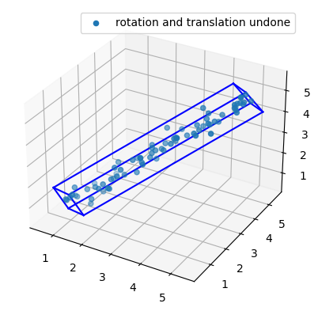
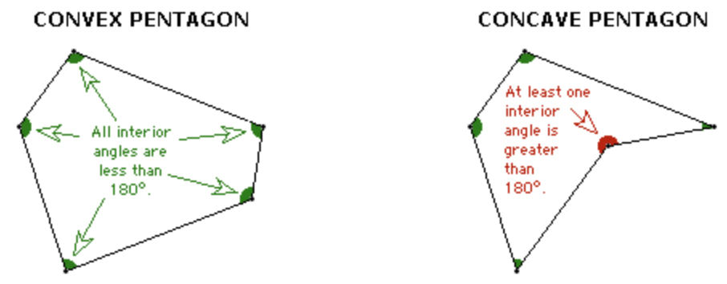

# Geometry Engine
A Python service that uses Flask to act as a geometry engine, capable of performing 3D geometric opperations on a provided set of coordinate points.

## Available endpoint computations
### Bounding Box 
Given an array of points, calculates the smallet oriented bounding box that contains all of the 3D points.  
A writeup of the mathematical concepts used in computing the bouding box can be found in ```bounding_box.ipynb```  
Returns a JSON of 3D **bounding box** coordinate points,  
[[x<sub>1</sub>, y<sub>1</sub>, z<sub>1</sub>], [x<sub>2</sub>, y<sub>2</sub>, z<sub>2</sub>], [...]]  



### Rotate Mesh
Given a 3D Mesh as an Input, rotates the mesh by X degrees along the specified axis.  
Returns a JSON of **rotated** 3D coordinate points,  
[[x<sub>1</sub>, y<sub>1</sub>, z<sub>1</sub>], [x<sub>2</sub>, y<sub>2</sub>, z<sub>2</sub>], [...]]   

### Move Mesh 
Given a 3D mesh as an input, moves the mesh by a, b and c units along X, Y and Z axis respectively.  
Returns a JSON of **moved** 3D coordinate points,  
[[x<sub>1</sub>, y<sub>1</sub>, z<sub>1</sub>], [x<sub>2</sub>, y<sub>2</sub>, z<sub>2</sub>], [...]]   

### Check Convex 
Given a polygon in 3D space represented by 3D Points, checks whether the polygon is convex.  
A convex polygon is defined as a closed figure where all interior angles are less than 180 degrees.  
Returns a **boolean** value in JSON format  

  

  
## How to run the service locally (Linux/macOS only)
* run ```./setup_and_run.sh``` to configure a virtual environment, install dependencies, and run the web application locally
* subsequent Flask web app runs can be called by running ```run.py```  
* Geometry engine computations can be ran using HTTP GET or POST requests
* See ```example.py``` or ```example.sh``` for example usage
  
## Testing
### Geometry Engine 
* Geometry engine functions have been tested using the Pytest framework. Testing confirms that each of the four opperations return expected values given specified inputs
* The oriented bounding box problem is the most complex opperation, and requires further testing with more difficult point sets and edge cases to assert its validity
* Geometry engine functions can be tested by running ```pytest ./tests/test_geometry_engine.py```

### API Endpoints
* API endpoints have been tested to confirm that the expected JSON objects are returned when required function parameters have been provided
* API endpoints have been tested to confirm that insightful errors and graceful exits occur when the provided parameters are incorrect
* Tests can be ran by running ```pytest ./tests/test_routes.py```. The server must be running while testing API endpoints.
* Error checking API parameters is done manually using decorators. Given more time I would explore Flask-Conenexion and the Swagger/openAPI Specification
* An OpenAPI specification file describing API endpoints is available as ```openapi.json```

